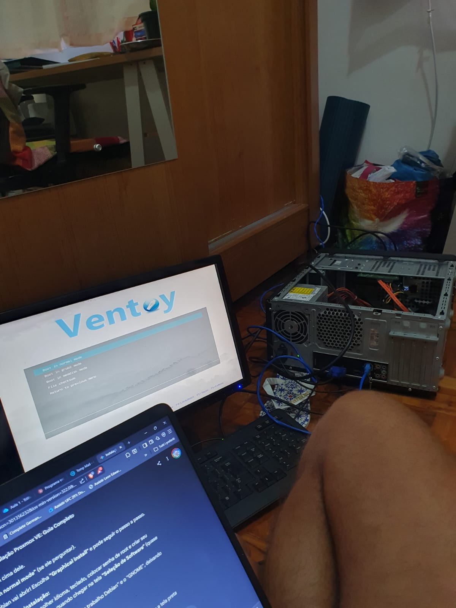
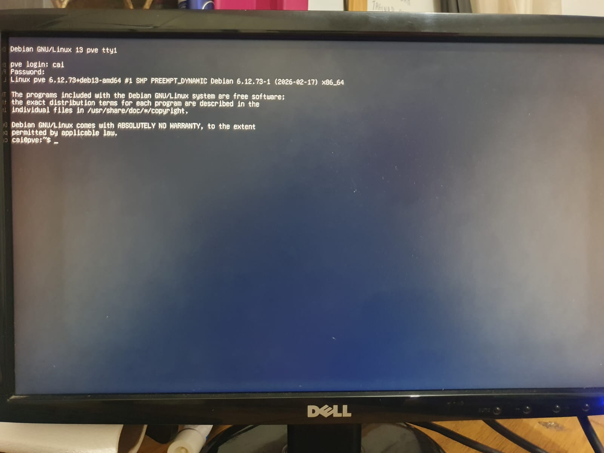

# Documentação do Home Lab – Semana 1

## Resumo

Iniciei oficialmente a construção do meu home lab. O objetivo final é transformar uma máquina Dell em um servidor de virtualização utilizando o Proxmox VE. A semana foi marcada por adaptações de estratégia, resolução de problemas de hardware legado e configuração de um sistema operacional base do zero, operando inteiramente via linha de comando (CLI).

---

## 1. Preparação do Boot e a Solução com Ventoy

A jornada começou com dificuldades na criação da mídia de instalação. As primeiras tentativas envolveram ferramentas tradicionais: testei o Balena Etcher e o Rufus, mas o hardware legado da Dell se recusava a aceitar o boot nas duas configurações. Tentei inicialmente usar a ISO direta do Proxmox e, diante da falha, tentei a ISO do Debian, ainda sem sucesso com esses gravadores.

A virada aconteceu quando preparei o pendrive usando o **Ventoy** software de código aberto que oferece compatibilidade muito maior com hardware legado, independente das configurações de BIOS. Somente com ele a máquina aceitou e executou o boot. Com esse obstáculo superado, defini a estratégia de construir o servidor em camadas: instalar o Debian 13 na versão mais enxuta possível e, posteriormente, instalar o Proxmox por cima. Essa abordagem contorna as limitações de hardware e dá mais controle sobre a base do sistema.

---

## 2. Decisão de Armazenamento: SSD vs. HDD

Na etapa de particionamento, precisei decidir onde instalar o sistema. A máquina tem dois discos:

- HD antigo (Western Digital) de ~298 GB
- SSD (STAR SSD) de ~112 GB

Optei pelo SSD mesmo com menos espaço. O sistema operacional e o hypervisor precisam de velocidade de leitura e escrita para não virar gargalo. O HD ficará para depois e será usado dentro do Proxmox como armazenamento secundário para ISOs e backups.

---

## 3. Instalação Offline

Durante a instalação, o Debian não reconheceu a placa de rede da Dell. Isso causou falha na etapa de configuração do gerenciador de pacotes, já que o sistema estava sem internet. A solução foi ignorar os erros e continuar a instalação usando apenas os arquivos presentes localmente no pendrive, resultando em um sistema mínimo.

---

## 4. Minimalismo por Escolha

Na etapa de seleção de software, as opções de interface gráfica já não apareciam por falta de internet. Mas mesmo que aparecessem, a escolha seria a mesma: servidor sem GUI. Cada megabyte de RAM importa quando o objetivo é rodar máquinas virtuais. O servidor nasceu focado em performance e controle via terminal.

A instalação foi finalizada configurando o GRUB diretamente no SSD, garantindo que ele conseguisse dar boot sozinho.

---

## 5. Conflito de Boot

Após a instalação, ao reiniciar sem o pendrive, apareceu uma tela de recuperação de erro do Windows. O problema: a BIOS estava configurada para dar boot no HD antigo, que ainda tinha resquícios de uma instalação antiga do Windows, e não no SSD onde o Debian foi instalado.

Solução provisória: forçar o desligamento, ligar pressionando F12 repetidamente para abrir o menu de boot da placa-mãe e selecionar o SSD manualmente. Com isso, o GRUB carregou e cheguei à tela de login `tty1` do Debian.

---

## 6. Configuração de Teclado

No primeiro login, percebi que o teclado estava configurado para o layout americano. Como o servidor estava sem internet e precisei operar fisicamente com um teclado brasileiro, símbolos como `/` e `-` estavam fora de lugar.

**Solução:**
```bash
dpkg-reconfigure keyboard-configuration
```
Alterei para Brasil > Português (Brasil). O terminal passou a reconhecer o layout físico imediatamente.

---

## 7. Status do Final da Semana

O servidor estava com o Debian operando em modo terminal, instalado no disco correto. Porém, o comando `ip a` mostrava apenas a interface `lo` (loopback), ou seja,  o Linux não enxergava a placa de rede física.

Fora isso, servidor funciona e rodando, abaixo estão fotos que resumem o processo.




---

## Próximos Passos

Com o problema de rede identificado, os próximos objetivos são:

- Investigar via CLI o motivo da placa não ser reconhecida
- Encontrar algum meio alternativo de conexão para baixar repositórios e firmwares necessários
- Com a rede funcionando, adicionar os repositórios do Proxmox e instalar o hypervisor
- Ajustar a BIOS para que o SSD seja a opção de boot padrão, sem depender do F12