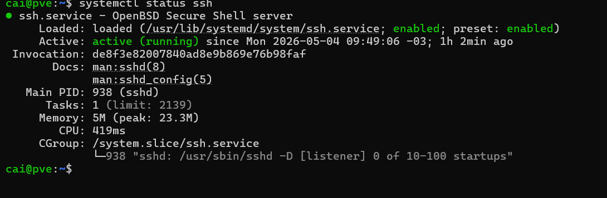

# Documentação do Home Lab – Semana 2

## Resumo

Se a semana anterior foi vencer o hardware e conseguir instalar o Debian, essa semana foi dar vida ao servidor. O objetivo era tirar a máquina do isolamento offline, dar a ela um endereço fixo na rede e permitir acesso remoto via SSH para nunca mais precisar do monitor e teclado físicos.

---

## 1. Despertando a Placa de Rede

A primeira barreira foi a conectividade. Mesmo com a placa de rede aparecendo no `lspci`, o servidor não conversava com o roteador.

Antes de qualquer coisa, entendi o que o nome `enp2s0` significa. No Linux, as interfaces de rede seguem uma nomenclatura previsível gerada pelo `udev`, logo `en` indica ethernet, `p2` aponta para o barramento PCI 2 e `s0` para o slot 0. Não é um nome aleatório, ele localiza o hardware fisicamente na placa-mãe.

Testei a conectividade básica:

```bash
ping -c 3 google.com
```

Falhou. A interface estava desativada. Logado como root, forcei a ativação:

```bash
ip link set enp2s0 up
```

Reconectei o cabo de rede fisicamente no modem e no servidor para forçar um handshake limpo com o roteador. Isso foi importante poorque só ativar a interface via software não bastou, a reconexão física fez a placa e o roteador se reconhecerem.

Para obter um IP temporário, tentei primeiro:

```bash
dhclient enp2s0
```

Não funcionou. A alternativa foi usar uma versão mais leve e moderna:

```bash
dhcpcd enp2s0
```

Isso solicitou ao servidor DHCP do roteador um endereço IPv4, máscara de sub-rede e DNS. Conectividade estabelecida.

---

## 2. IP Estático

Depender de IP dinâmico é inviável para um servidor. Se o roteador decidir mudar o endereço, o acesso SSH para de funcionar.

Acessei o arquivo de configuração de rede:

```bash
nano /etc/network/interfaces
```

Como a instalação foi feita offline, o arquivo estava praticamente vazio, sem nenhuma configuração da interface `enp2s0`. Configurei manualmente com um IP fixo fora do alcance do DHCP padrão do roteador, definindo também a máscara de sub-rede (`netmask`) e o endereço do gateway.

O servidor agora tem um endereço fixo na rede local.

---

## 3. O Paradoxo do Manual e os Repositórios

Com rede funcionando, tentei instalar pacotes:

```bash
apt update
```

Falhou. O problema veio da instalação offline. O Debian ainda procurava os pacotes no pendrive Ventoy em vez de servidores na internet. A lista de repositórios em `/etc/apt/sources.list` estava essencialmente vazia.

Fui editar o arquivo para corrigir isso. O próprio arquivo dizia para consultar o manual, seção 5. O problema: para ler o manual eu precisaria do pacote `man`, e para instalar qualquer coisa eu precisava justamente dos repositórios que estava tentando corrigir. Um problema bem engraçado para dizer o minimo. 

Busquei a documentação pelo Windows e escrevi manualmente os repositórios no `sources.list`. Configurei o repositório padrão para atualizações do dia a dia e também o repositório de segurança:

```
security.debian.org
```

Com os repositórios corretos, rodei:

```bash
apt update && apt upgrade
```

O sistema baixou atualizações, incluindo patches do kernel. Como o kernel é o núcleo do sistema, executei um reboot para garantir que a máquina iniciasse com a versão atualizada.

---

## 4. SSH e Permissões

O objetivo final da semana era acessar o servidor remotamente pelo Windows, sem depender do monitor e teclado físicos.

Verifiquei o status do SSH:

```bash
systemctl status ssh
```

Retornou `could not be found`. O serviço não estava instalado. Instalei o pacote responsável por ouvir as requisições de rede:

```bash
apt install openssh-server -y
```

Confirmei a ativação:

```bash
systemctl status ssh
```

Depois instalei o `sudo`, que não vem por padrão no Debian minimalista. Ele permite executar comandos administrativos sem precisar logar diretamente como root. Por fim, adicionei meu usuário ao grupo administrativo:

```bash
usermod -aG sudo cai
```

A partir daí, passei a acessar o servidor inteiramente pelo terminal do Windows via SSH. Monitor e teclado físicos aposentados.

---

## Status no Final da Semana

O servidor Debian está atualizado, com IP fixo na rede local, repositórios configurados e acessível remotamente via SSH. A base está pronta para receber o Proxmox.



---

## Próximos Passos

- Criar chave SSH para autenticação sem senha (`ssh-keygen`)
- Instalar o Proxmox por cima do Debian
